# Примечание

Фильтрация и агрегация реализованы через подкоманды — данное решение было принято по причине удобства расширяемости интерфейса. При необходимости может быть изменено.

# Примеры запуска програмы.

## Все данные.

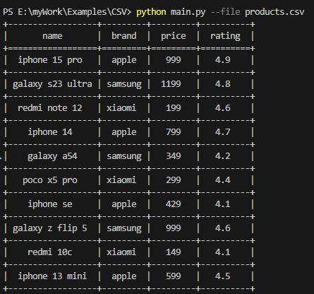

## Агрегация.

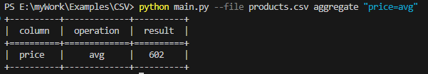
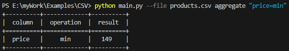
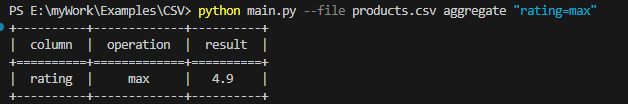

## Фильтры.

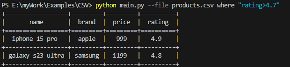
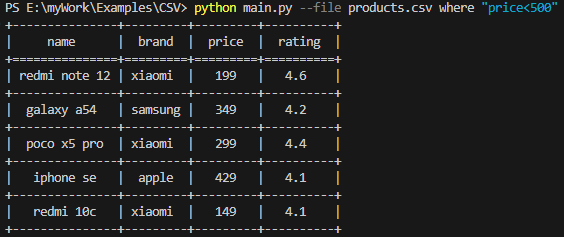
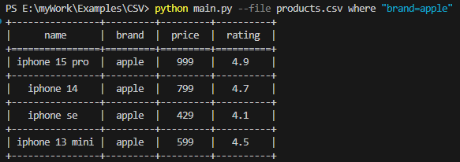

## Сортировка.

### Все данные.

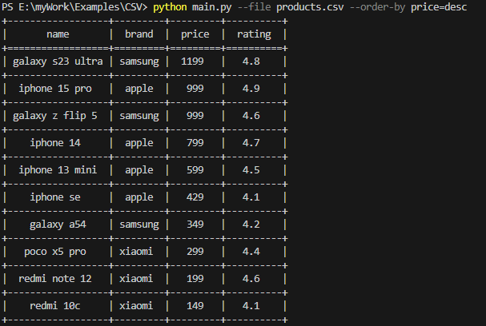
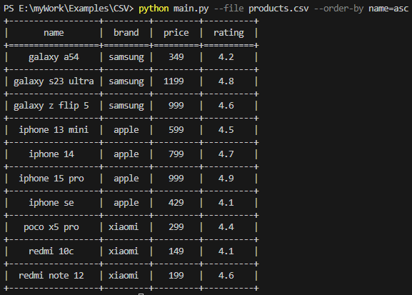

### Фильтры.

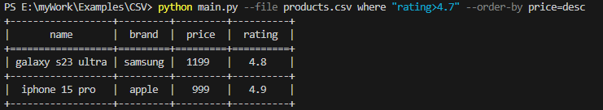
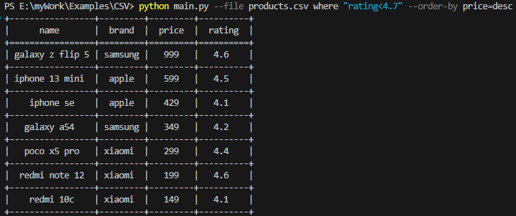
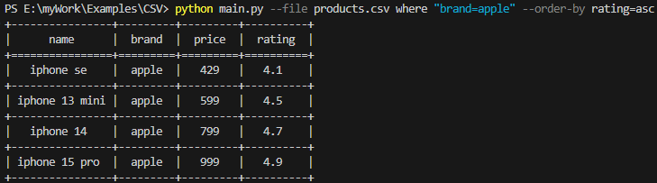

